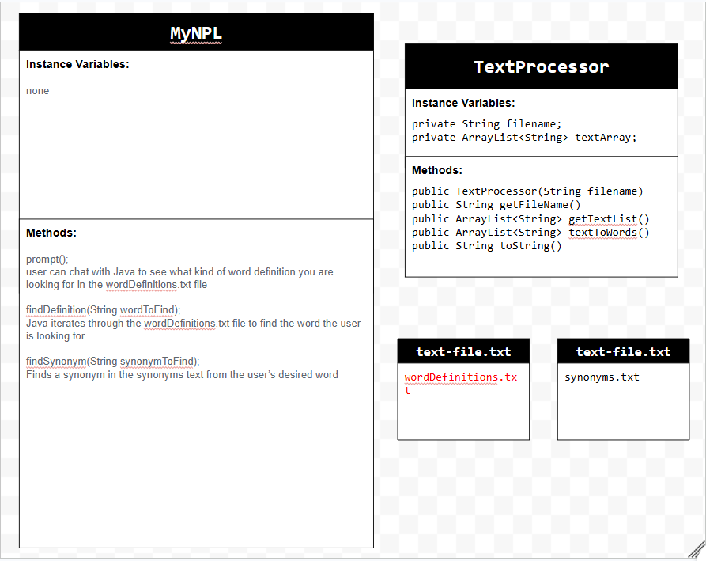
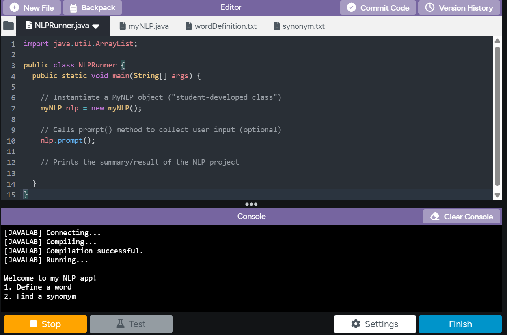

# Unit 6 - Natural Language Processing Project

## Introduction

Natural language processing (NLP) is used in many apps and devices to interact with users and make meaning of text to determine how to respond, find information, or to create new text. Your goal is to use natural language processing techniques to identify structure, patterns, and meaning in a text to have conversations with a user, execute commands, perform manipulations on the text, or generate new text.

## Requirements

Use your knowledge of object-oriented programming, ArrayLists, the String class, and algorithms to create a program that uses natural language processing techniques:

- **Create at least two ArrayLists** – Create at least two ArrayLists to store the data used in your program, such as data from text files or entered by the user.
- **Implement one or more algorithms** – Implement one or more algorithms that use loops and conditionals to find or manipulate elements in an ArrayList or String object.
- **Use methods in the String class** - Use one or more methods in the String class in your program, such as to divide text into sentences or phrases.
- **Use at least one natural language processing technique** – Use a natural language processing technique to process, analyze, and/or generate text.
- **Document your code** – Use comments to explain the purpose of the methods and code segments and note any preconditions and postconditions.

## UML Diagram

Put an image of your UML Diagram here. Upload the image of your UML Diagram to your repository, then use the Markdown syntax to insert your image here. Make sure your image file name is one word, otherwise it might not properly get displayed on this README.

## Video

Record a short video of your project to display here on your README. You can do this by:

- Screen record your project running on Code.org.
- Upload that recording to YouTube.
- Take a thumbnail for your image.
- Upload the thumbnail image to your repo.
- Use the following markdown code:

## Project Description

The goal of our application is two branches, to define a word or to find a synonm of a word based upon the user's input. When the application runs, the console prints out numbers 1 and 2 defining and finding a synonym respectivly. The user will then type either 1 or 2; then they will type what word they would like to define or find the synonym of. The text files of wordDefinition and synonym are then read to based upon the input, checking if the input word matches one of the words in its file. If the word can't be found in the file then the application with print, "Goodbye!" but if the word can be found in the text file then the definition or synonyms of the word will be printed.

## NLP Techniques

We used NLP techniques to run through the textfiles wordDefinition.txt and synonym.txt, implementing the methods indexOf() and subString(). The findDefinition findSynonym method takes the word defined by the given parameters provided by the indexOf to find where to start and stop. Then that the inputted word from the user is stored as a string to be compared to the text file. These methods togethers works as counterparts, helping our application work with funtionality and purpose.
